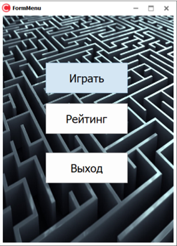
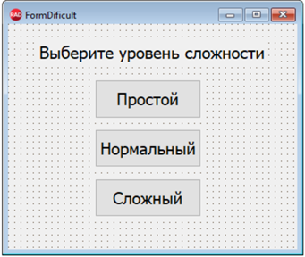
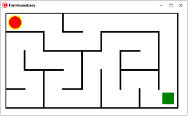
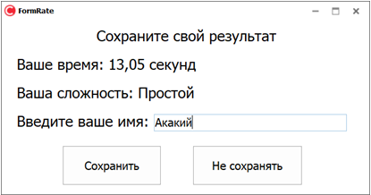
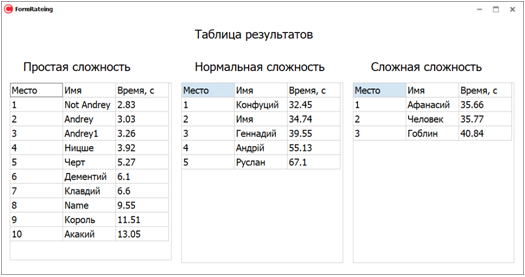

<!-- # Maze Game

My first course project project 

### When your open app you will see menu, where your can choose what to do

### After hitting Play button you will be able to choose difficulty. The size of the generated maze depends on this

### Then generated maze will appear. You can control character (red circle) with keyboard

### After reaching the end of maze you will be prompted to save your result

### Then you will see yourself in leaders board

 -->

<!DOCTYPE html>
<html>
    <body>
        

            <h1 align="center">
                <b>Maze Game</b>
            </h1>
            My first course project project 
            

                When your open app you will see menu, where your can choose what to do
            

            

                
            

            

                After hitting Play button you will be able to choose difficulty. The size of the generated maze depends on this
            

            

                
            

            

                Then generated maze will appear. You can control character (red circle) with keyboard
            

            

                
            

            

                After reaching the end of maze you will be prompted to save your result
            

            

                
            

            

                Then you will see yourself in leaders board
            

            

                
            

        

    </body>
</html>